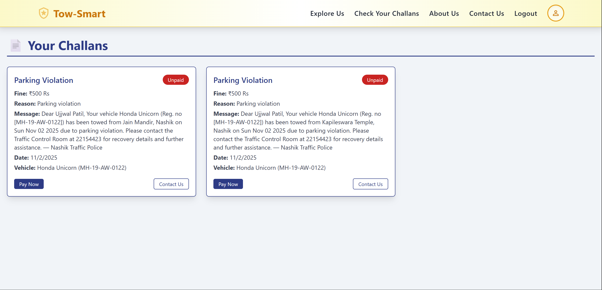
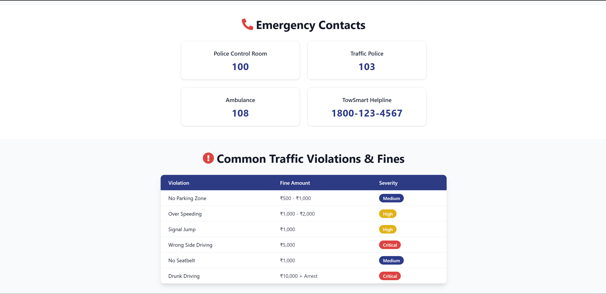
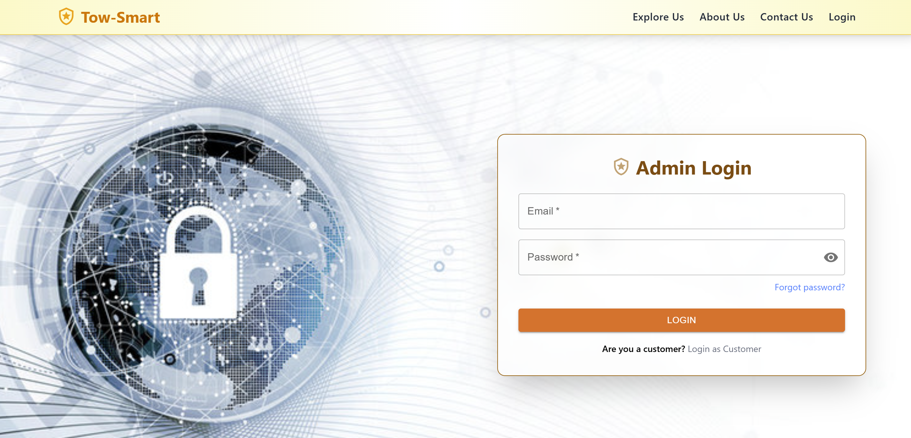
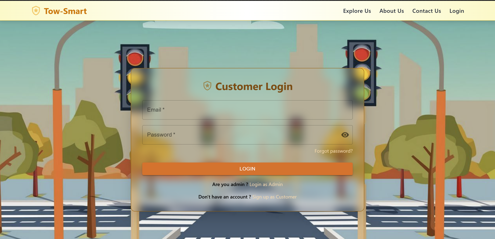
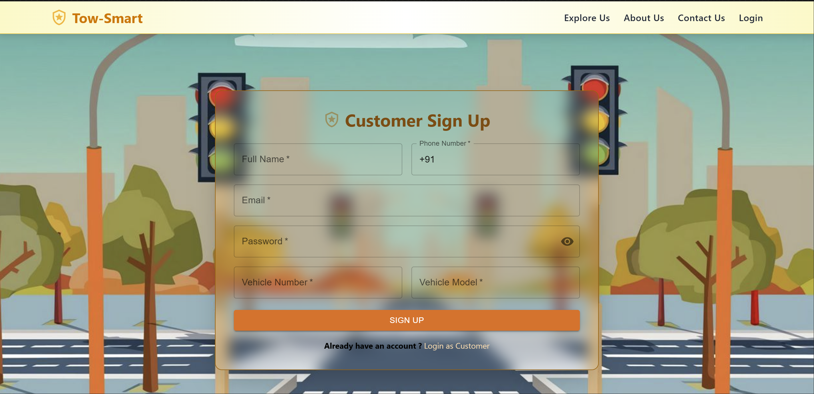

# TowSmart – Real-Time MERN based Vehicle Towing Request Management System


## 📌 About the Project

**TowSmart is a smart MERN based towing alert system built to simplify the entire towing communication process.

Whenever any vehicle is towed, the Admin can directly send towing notification & fixed police office address to the owner via email — including Google Maps location link.

> ⚙️ Fully implemented with secure user auth, OTP verification, challan history, admin panel & email automation.

---

## 🔧 Tech Stack

### 🖥️ Frontend (React + Vite)
- React.js, Vite
- Tailwind CSS, Material UI
- EmailJS (OTP)
- Cloudinary
- Fully Responsive

### ⚙️ Backend (Node.js + Express)
- Express + Node.js
- MongoDB + Mongoose
- JWT & bcryptjs Auth
- Modular REST APIs

---

## 🛒 Core Features

### 👤 User Side
- Self registration using vehicle number
- OTP verification via EmailJS
- Forgot password functionality
- See all challans in history
- Contact Admin through contact form
- Receives towing notification email with Google Maps location link

### 🛠️ Admin Panel
- Add towing challans / records
- Search vehicle by number
- Send towing email notification to customer
- View all tow history
- Manage all customers

---

## 🌐 Hosted Links

- 🚀 **Frontend**: [https://tow-smart-three.vercel.app/](https://tow-smart-three.vercel.app//)
- 🌐 **Backend**: [https://tow-smart.onrender.com](https://tow-smart.onrender.com)

---

##  Installation Guide (Local Setup)

>  Follow these steps to run the project on your local machine


### 1. Clone the repository
Clones the full stack repo to your system.

```bash
git clone https://github.com/ujjwalpatil07/Tow-Smart.git
```

### 2. Move to the Project Directory
Navigate into the main project folder.

```bash
cd TowSmart
```

### 3. Set Up the Client (Frontend) 
Navigate to the Client directory.
```bash
cd Client
```

Install all required frontend dependencies.
```bash
npm install
```

Start the frontend development server.
```bash
npm run dev
```


#### 4. Create Environment File for Client
```env
VITE_EMAILJS_SERVICE_ID=<your_emailjs_service_id>
VITE_EMAILJS_PUBLIC_KEY=<your_emailjs_public_key>
VITE_EMAILJS_TEMPLATE_ID_OTP=<your_emailjs_template_id_otp>
VITE_EMAILJS_TEMPLATE_ID_NOTIFICATION=<your_emailjs_template_id_notification>
VITE_EMAILJS_PUBLIC_KEY_TOWSMART=<your_emailjs_public_key_towsmart>
VITE_EMAILJS_SERVICE_ID_TOWSMART=<your_emailjs_service_id_towsmart>
VITE_EMAILJS_TEMPLATE_ID_CONTACTUS=<your_emailjs_template_id_contactus>
```

### 5. Set Up the Server (Backend)
Open a new terminal and navigate to the server folder.
```bash
cd Server
```

Install all backend dependencies.
```bash
npm install
```

Start the backend development server.
```bash
nodemon
```

### 6. Create Environment File for Server
```env
PORT=<your port>
TOwSMART_DB_URL=<your_mongodb_uri>
```

---

## 📸 Screenshots & UI Preview

| Homepage Admin | Tow History | OTP Verification |
|----------|--------------|-----------------|
|  |  | 

| Challan History | Safety Rules | Emergency Contacts |
|--------|----------------|----------------|
|  |  |  |

| Admin Login | Customer Login | Customer Signup |
|--------|----------------|----------------|
|  |  |  |


>  This project represents a real world use-case for digital towing management — combining automation, email communication, user auth and admin control panel into one platform.

---

##  Connect With Me
If you're working on something similar, have questions, or want to collaborate, feel free to connect! I’d love to hear from you. 🚀

-  [LinkedIn](https://www.linkedin.com/in/ujjwal-patil-9908782b0/)
-  [Email](mailto:ujjwal.patilofficial07@gmail.com)
  
